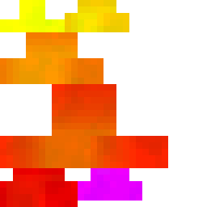
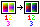

# Creating Parts

A guide to adding new parts, subtypes, and textures to Tails.

If you're looking to add a part of some kind, scroll to [parts](#parts) and work your way down.
Otherwise, here are links to everything covered:

* [Parts](#parts)
* [Subtypes](#subtypes)
* [Textures](#textures)

## Parts

### File formats

Parts are defined by resource packs under the `parts` directory.
For example, `tails:parts/tail/fluffy_tail.json` is the path to Tails's fluffy tail part definition.
The `tail/` subpath is optional and used only because Tails has quite a few parts.

Parts may be defined under any namespace; `tails` is just the one that Tails defines all its parts under.

Part definitions have the following format:

```js
{
  "attachment": "<one of: body/head>/<location of part on body/head>", // Specifies the attachment point of the part; mandatory
  "defaultTints": ["0xff0000", "0x00ff00", "0x0000ff"], // Specifies the default tints of the part, which is shown in the part preview; optional
  "ordering": [ // Specifies the subtype ordering in the texture/variant panel; optional
    "standard" // Indicates that the subtype "standard" is the first subtype. Subtypes not listed here will be added to the end of the ordering in alphabetical order.
  ],
  "allowArrows": false, // Specifies whether arrows should randomly render on this part; optional
  "model": { ... }, // The part's model, see further down; optional
  "render": { ... }, // The part's render transforms; optional
  "preview": { ... } // The part's preview transforms; optional
}
```

For example, the fluffy tail file from earlier has the following content:

```json
{
  "attachment": "body/tail",
  "ordering": [
    "one_tail",
    "two_tails",
    "three_tails",
    "nine_tails"
  ],
  "allowArrows": true,
  "model": { ... }
}
```

Specifying no ordering is discouraged:

```json
{
  "attachment": "head/top_ears"
}
```

This is perfectly legal, but may cause subtle subtype ordering problems.
Because other resource packs can add new subtypes, their subtypes might come before yours!

#### The root ordering

The file `tails:part_ordering.json` defines the order of the parts shown in the part panel.
Its format looks like this:

```json
{
  "body/tail": [
    "tails:tail/fluffy_tail"
  ],
  "body/back": [
    "tails:wings/big_wings"
  ],
  "head/top_ears": [
    "tails:ears/fox_ears"
  ],
  "head/face": [
    "tails:muzzle/standard_muzzle"
  ]
}
```

Each of these arrays defines the ordering of parts within that specific attachment point.
Parts that aren't defined in the ordering automatically go at the end of the list, in alphabetical order.

### Making a part

To go about creating a part, one should first create the necessary part definition.
For this guide, we'll create an "example tail" under the `example` namespace.

#### The part definition

Our example tail part definition will look something like this:

```json
{
  "attachment": "body/tail",
  "ordering": [
    "standard"
  ],
  "allowArrows": true
}
```

This is the most common part definition, specifying only an attachment and ordering — and since this is a tail, allowing arrows to be stuck in it.
The ordering of the part will be important later.

This json file will go in the `example:parts` directory with the name `example_tail.json`.
The id of the part is automatically inferred from the filename.

#### Translations

Before we move on to the subtype, we'll want to give our custom tail a translation.

First, this will require creating the file `example:lang/en_us.json`.

Next, we add the following content:

```json
{
  "example.part.example_tail": "Example Tail"
}
```

This format is roughly similar to Minecraft's existing `type.namespace.id` syntax (e.g. `block.minecraft.torch`), but with the namespace and type swapped.

Now that we have a translation, we can look at subtypes.

## Subtypes

Subtypes can be thought of as variants of a part.
They tend to customize the structure of the part, such as making certain pieces (in)visible.
Every part has at least one subtype, and (hopefully) vice versa.

### File format

A subtype's file format is fairly simple:

```js
{
  "author": "<name of the creator of the subtype>", // Optional
  "pose": { ... }, // The transforms to apply to the part when this subtype is selected; optional
  "hideParts": [], // The parts of the model to hide when using this subtype; optional
  "showParts": [] // The parts of the model to show when using this subtype; optional
}
```

Yep, that's it. That's all there is to a subtype definition.
Many subtypes only have the content `{}`.

All of these subtype files go under the `parts/subtypes` directory plus the id of the part the subtype is for.
The namespace *must* match the namespace of the part.

For example, `tails:parts/subtypes/tail/fluffy_tail/one_tail.json` identifies the single tail subtype of the fluffy tail.
It is a combination of `parts/subtypes/` (the subtypes folder), `tail/fluffy_tail/` (the part id), and `one_tail.json` (the subtype id).
The namespace also matches the part, as the full part id is `tails:tail/fluffy_tail`.

### Making a subtype

Continuing from where we left off, we just finished making a part definition for `example:example_tail`.
Now, we can make a subtype for it.

A part may have any number of subtypes, but we will only be making one subtype for our part.
The subtype definition will look like this:

```js
{
  "author": "EnderTurret" // replace this with your name when making your part
}
```

This file should be saved as `example:parts/subtypes/example_tail/standard.json`.

#### Translation

Similar to parts, subtypes also need translations.
Let's add a translation for our subtype, right after the part:

```json
{
  "example.part.example_tail": "Example Tail",
  "example.part.example_tail.subtype.standard": "Standard"
}
```

#### Making a model

In order for the part to actually show anything, we'll need to give it a model.
We can use [BlockBench](https://www.blockbench.net) for creating our model (use the modded entity format).

I won't be creating a model for our example tail, as it's just a hypothetical tail part for the guide.
However, if you're adding a custom part or subtype, you'll need a model for it.

Now unfortunately, Minecraft does not yet have data-driven entity models, so adding a part model is a lot more involved.
This process will hopefully improve once entity models are fully data-driven.

Once you have a model, it'll need to be saved as a `.java` file (use the `Export > Export Java Entity` option).
This file contains all of the Java code necessary to define a model and probably looks something like this:

```java
public class custom_model<T extends Entity> extends EntityModel<T> {

	// ...

	public static LayerDefinition createBodyLayer() {
		// ...
	}

	// ...
}
```

For the purposes of adding a part model, we only need the contents of the `createBodyLayer()` section -- all of the rest is irrelevant.

Here's the part of adding a model that gets *really* complicated.

#### Implementing a part model

TODO: Write this entire section now that part models are data-driven.

## Textures

### File format

This is what the texture file format looks like:

```js
{
  "author": "<the name of the creator of the texture>", // Optional
  "applyTo": [ // A list of subtypes this texture applies to; mandatory
    "standard"
  ],
  "path": "mypack:textures/path/to/texture.png", // Optional; defaults to <namespace>:textures/part/<part id>/<texture id>.png
  "tintingStrategy": "<one of: triple_tint, single_tint, no_tint>" // Specifies how the texture should be tinted; optional, defaults to triple_tint
}
```

Similar to subtypes, texture files go in the `parts/textures` directory plus the part id.
For example, `tails:parts/textures/tail/cat_tail/tiger.json` references the tiger texture of the cat tail.

#### Texture ordering

Like subtype ordering, textures can and should be ordered too.
Different to subtypes, however, is the location of this ordering.

Textures orderings are specified in a file called `ordering.json` in the same folder as all the textures for the part.
As such, you can never have a texture called "ordering"; it is a reserved name.

Texture orderings are incredibly simple:

```json
[
  "tabby",
  "tiger"
]
```

This is the contents of the ordering for the cat tail.
As you can see, there's not a whole lot going on.

### Making a texture

Picking up yet again where we left off, we now have a subtype for our example tail.
Now, we will make a texture for our tail.

First off, let's start by adding these contents to a file at `example:parts/textures/example_tail/standard.json`:

```json
{
  "applyTo": [
    "standard"
  ]
}
```

We will also add an `ordering.json` in the same place with the following content:

```json
[
  "standard"
]
```

And for the last easy part, let's add a translation:

```json
{
  "example.part.example_tail": "Example Tail",
  "example.part.example_tail.subtype.standard": "Standard",
  "example.part.example_tail.texture.standard": "Standard"
}
```

Now before we can add a texture image, I need to explain how Tails's triple tinting works.

#### How triple tinting works

The basic understanding is that Tails takes three different tints and applies them to seemingly different parts of the image.
This raises the question of "how does Tails know which tint goes where?"

To answer this, let's first take a look at the fluffy tail part texture.



This obviously looks nothing like what the fluffy tail looks like in game.
So let's look at what each color *actually means*.

Let's say we're looking at the pixel in the top left part of the largest orange-red chunk, which is `ff2c00`.

If we break this pixel down, we have three components: `ff` (the red component), `2c` (green), and `00` (blue).
These are the color components, sure. But what if I told you they're all wrong?

The pixel here is actually made of these components: `ff` (the *saturation component*), `2c` (the *first weight component*), and `00` (the *second weight component*).
The easiest one here to understand is the saturation component, which determines how intense or "saturated" the output pixel is.
It's an easy way to specify how bright or dark something is.

The weight values on the other hand determine how much of each tint affects the pixel.
It might help if we visualize it:


This is a grid where the first weight increases along the x axis (towards the right) and the second weight increases along the y axis (towards the bottom).
The saturation is a constant `ff`.

In this grid, the red (or top left) corner is affected by the first tint, the yellow (or top right) corner is affected by the second tint, and the magenta (or bottom) section is affected by the third tint.

Let's say we have the default tints `ff0000`, `00ff00`, and `0000ff`, which are red, green, and blue, respectively.
If we apply these tints to the matrix, we get something that looks like this:


#### Back to texturing

Now, in order to add a texture for your texture, you've got a few options.

If for example, you're creating a texture for an existing part for personal use, you might not care about tinting.
In this case, you can make the texture as it should appear in game and then disable tint processing by adding this to your texture definition:

```json
"tintingStrategy": "no_tint"
```

If you're creating a part or texture you want others to be able to customize, such as a spotted pattern for the fluffy tail, then you'll want to use this triple-tint system.

If you go with triple-tinting, you'll likely want these colors: `ff0000` (tint 1), `ffff00` (tint 2), and `ff00ff` (tint 3).
These are the colors that are most affected by their respective tint and no others.
You can also use the "color matrix" images from the previous section as references.
Finally, there's also this image which is a palette of sorts for different triple-tint colors.
It may or may not be useful.



Regardless of format, you can and should preview your texture in-game.
Additionally, `F3 + T` forces a resource reload, which will also reload all of the parts.
(You can also use Tails's keybind for reloading parts, but this won't reload the textures.)
You can use that to aid in your development.