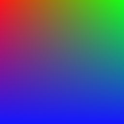

# Triple Tinting

In Tails Legacy (and in the original Tails), almost all part textures are tinted using three tints in what both mods call "triple tint textures." This document describes how that works.

### The pixel format

In triple tint textures, each 'pixel' is really four pieces of data: the brightness, the horizontal color coordinate, the vertical color coordinate, and the opacity. These are stored in the red, green, blue, and alpha channels, respectively.

The color coordinates are used to look up the result tint in the *color matrix*, which is arranged like so:

This is the identity (i.e., unchanged) color matrix, which is just the colors arranged on a grid. On here, we can see how pixel values correspond to locations in the color matrix. A value of `#ff0000` is the top-left corner, since both the x and y coordinates are 0 (note that the `ff` is the brightness). A value of `#ffff00` is the top-right corner, since the x coordinate is 255 and the y coordinate is 0. Finally, a value of `#ffffff` is the bottom-right corner, since both the x and y coordinates are 255.

Next, when the default tints (`#ff0000`, `#00ff00`, and `#0000ff`) are applied, the color matrix looks like this:

Now we can see how those coordinates end up choosing a color. A value of `#ff0000` corresponds to the top-left corner, ending up as tint 1 (red). A value of `#ffff00` corresponds to the top-right corner, ending up as tint 2 (green). Finally, a value of `#ff00ff` corresponds to the bottom-left corner, ending up as tint 3. Between these points, you get smooth transitions from one tint to another.